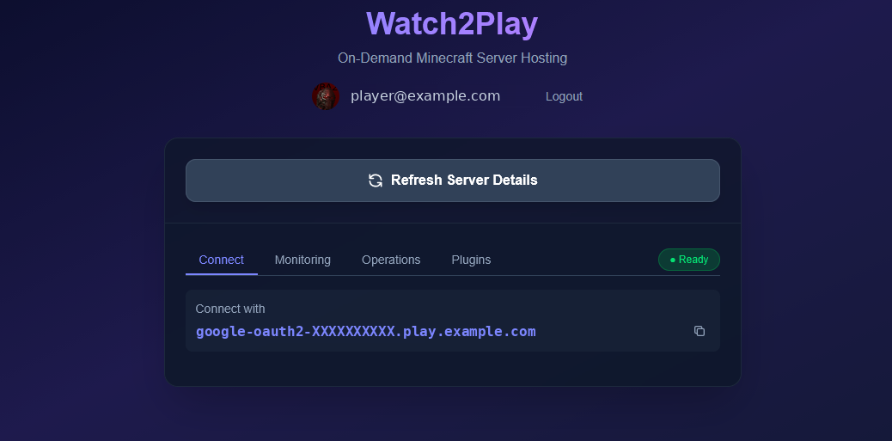
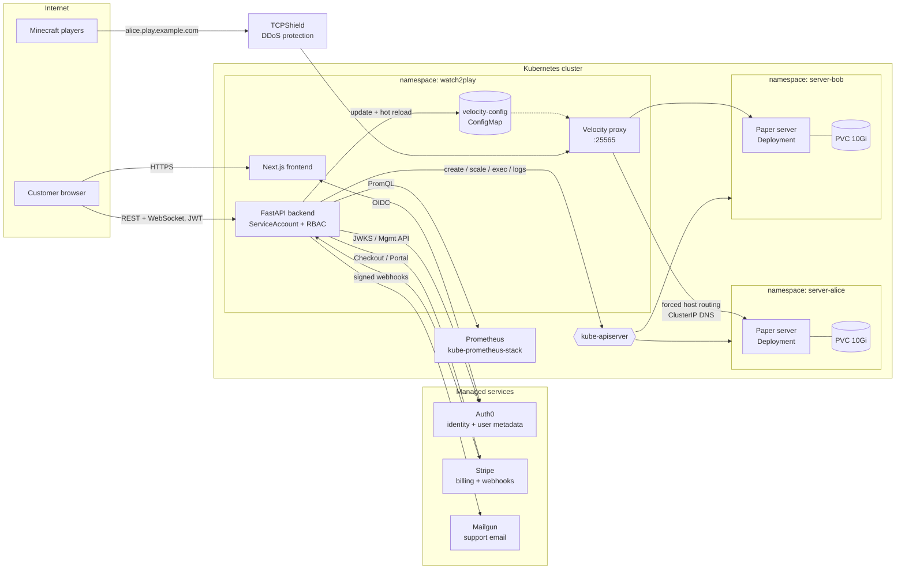
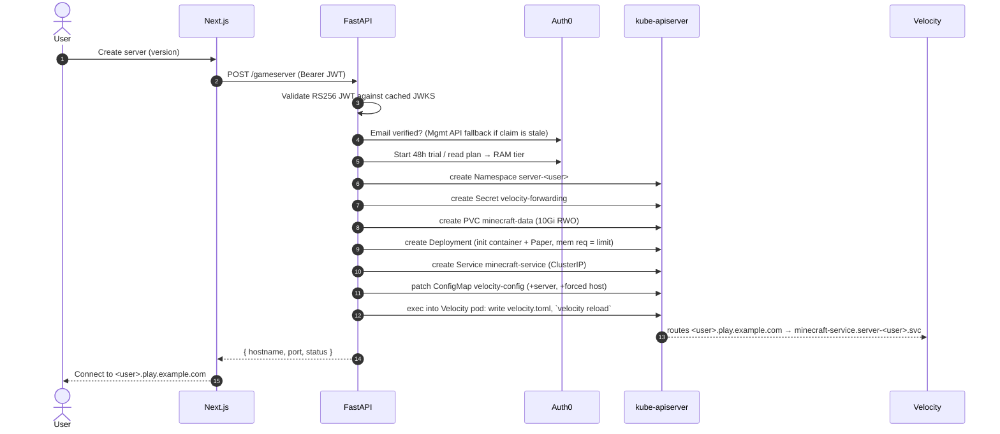

<p align="center">
  
</p>

<h1 align="center">Game Server Platform</h1>

<p align="center">
  <b>A Kubernetes-native, multi-tenant game server hosting platform.</b><br>
  It self-provisions isolated game servers through the Kubernetes API and ships as a full SaaS product with auth, billing, email, support and admin tooling.
</p>

<p align="center">
  
  
  
  
  
  
  
  
</p>

> **About this project.** I built this platform to push my DevOps and platform engineering skills end to end. Instead of stopping at a toy cluster demo, I set out to build something shaped like a real SaaS: multi-tenant provisioning through the Kubernetes API, custom proxy routing, observability, and all the product plumbing around it (auth, billing, email, support and admin tooling). It's branded **MinecraftHosting.gg** (internal codename *Watch2Play*, which is why you'll see `watch2play` in resource names) and runs on my own bare-metal Kubernetes cluster in my homelab ([see below](#the-homelab-behind-it)). The [roadmap](#what-id-do-next) says honestly what I'd harden before running it at scale.

<p align="center">
  
  <br>
  <sub>The customer dashboard: a provisioned server, its live status, and the per-tenant hostname players connect to (a subdomain of whatever base domain the platform is configured with).</sub>
</p>

---

## Table of contents

- [Built for any game, launched with Minecraft](#built-for-any-game-launched-with-minecraft)
- [Architecture](#architecture)
- [How a server gets provisioned](#how-a-server-gets-provisioned)
- [The proxy layer](#the-proxy-layer)
- [Kubernetes design decisions](#kubernetes-design-decisions)
- [Day-2 operations through the API](#day-2-operations-through-the-api)
- [A complete product, not just infrastructure](#a-complete-product-not-just-infrastructure)
- [Tech stack](#tech-stack)
- [Repository layout](#repository-layout)
- [Running it](#running-it)
- [What I'd do next](#what-id-do-next)
- [The homelab behind it](#the-homelab-behind-it)
- [License](#license)

---

## Built for any game, launched with Minecraft

The core idea is that **a game server is just a workload.** Almost nothing in the provisioning model is specific to Minecraft. Every hosted server, whatever the game, is the same four Kubernetes objects inside a tenant namespace:

| Layer | Kubernetes object | Game-agnostic? |
|---|---|---|
| Tenant boundary | `Namespace` `server-<user>` | ✅ Identical for every game |
| World / save data | `PersistentVolumeClaim` `<game>-data` | ✅ Only the mount path changes |
| The game process | `Deployment` (1 replica, scale 0↔1 for stop/start) | ⚙️ Image, ports, env and init config per game |
| In-cluster endpoint | `Service` `<game>-service` | ⚙️ Ports and protocol per game |
| Public routing | Proxy / edge | ⚙️ Depends on the game's network protocol (see below) |

The API already takes the game as a parameter (`POST /gameserver?game=minecraft`), and the PVC, labels and selectors are all keyed off it. Lifecycle (start/stop by scaling, delete by namespace deletion), billing, capacity accounting, metrics and log streaming work the same for any container.

### How the platform would add more games

The extension point is a **game template registry**: a declarative description of everything that differs between games. The provisioning code renders Kubernetes objects from a template instead of hardcoding them. A sketch of the design:

```python
@dataclass(frozen=True)
class GameTemplate:
    id: str                        # "minecraft", "valheim", ...
    image: str                     # container image
    ports: list[GamePort]          # name, port, protocol (TCP/UDP)
    data_path: str                 # where the PVC is mounted
    routing: Routing               # HOSTNAME_PROXY or DEDICATED_PORT
    console: Console | None        # RCON, stdin attach, or none
    env: Callable[[Plan], dict]    # plan-aware env (e.g. JVM heap from RAM tier)
    init: list[V1Container] = ()   # pre-start config writers

GAMES = {
    "minecraft": GameTemplate(
        id="minecraft", image="itzg/minecraft-server",
        ports=[GamePort("game", 25565, "TCP")], data_path="/data",
        routing=Routing.HOSTNAME_PROXY, console=Console.RCON,
        env=lambda plan: {"TYPE": "PAPER", "MAX_MEMORY": heap_for(plan), ...},
        init=[paper_velocity_forwarding_init()],
    ),
    "valheim": GameTemplate(
        id="valheim", image="lloesche/valheim-server",
        ports=[GamePort("game", 2456, "UDP"), GamePort("query", 2457, "UDP")],
        data_path="/config", routing=Routing.DEDICATED_PORT, console=None,
        env=lambda plan: {"SERVER_NAME": ..., "SERVER_PASS": ...},
    ),
}
```

The interesting engineering problem is **routing**, not orchestration:

- **Minecraft (Java)** puts the hostname the player typed into its handshake packet. That lets a single public IP:port serve every tenant, with a proxy routing on hostname, like SNI for HTTPS. That's the `HOSTNAME_PROXY` path this repo implements with Velocity.
- **Most UDP games** (Valheim, Rust, ARK, CS2) have no hostname in their handshake, so nothing on the wire tells you which tenant a packet is for. These games need `DEDICATED_PORT` routing: the backend runs a port allocator and exposes each server either as its own `LoadBalancer` IP from a pool, or on an allocated port behind a shared IP (Traefik UDP entrypoints or `NodePort`). Connection info comes back to the user as `ip:port`, or through DNS SRV records where the game client supports them.

### Why Minecraft first

Minecraft has the largest self-hosting market and a mature container image ([`itzg/minecraft-server`](https://github.com/itzg/docker-minecraft-server)). Its hostname-aware handshake also let me build the more elegant shared-IP proxy architecture first. So the product went deep on Minecraft: Paper servers, a Velocity proxy with hot reload, a Modrinth plugin installer, world uploads, a server console and a config editor. Everything below describes that implementation.

---

## Architecture



**Control plane.** The FastAPI backend is the platform's orchestrator. It runs in-cluster under a dedicated `ServiceAccount` and talks straight to the Kubernetes API through the official Python client. There's no Helm templating or shelling out to `kubectl` at request time: every server operation is a typed API call.

**Data plane.** Each customer's game server runs in its own namespace behind a `ClusterIP` service. Nothing tenant-owned is exposed to the internet directly. All player traffic enters through one Velocity proxy, which sits behind TCPShield.

**State.** The backend has no database. Subscription and profile state live in Auth0 `app_metadata`, payments live in Stripe, and **Kubernetes itself is the source of truth for server state**. "Is my server running?" is answered by reading the Deployment's `replicas` and `readyReplicas`, not by a row that could drift.

---

## How a server gets provisioned



What's worth calling out in [`backend/main.py`](backend/main.py):

- **Deterministic, DNS-safe tenant IDs.** The Auth0 `sub` (e.g. `google-oauth2|1234`) is sanitized to a DNS-1123 label, which becomes the namespace name, the Velocity server name and the player-facing subdomain. No lookup table needed.
- **Idempotent creates.** Namespace, PVC and Secret creation treat `409 Conflict` as success, so a retried or half-failed provision converges instead of erroring.
- **Right-sizing the JVM for its cgroup.** Memory `requests == limits`, so the scheduler reserves exactly what the customer pays for and the pod is never overcommitted. The JVM max heap is set to *limit − 512 MiB*, leaving headroom for metaspace, thread stacks and native buffers so the kernel OOM-killer doesn't take the server down under load. Initial heap is ⅓ of max, so reported usage reflects real consumption. Aikar's G1GC flags are enabled.
- **Init container for proxy trust.** A busybox init container writes Paper's `paper-global.yml` to enable Velocity modern forwarding before the server first boots. The forwarding secret comes from a namespaced `Secret` via `secretKeyRef`, never from a literal in the pod spec.
- **Plan changes applied at start.** `POST /gameserver/start` re-reads the customer's plan and patches the Deployment's memory limits and heap before scaling to 1, so a plan upgrade takes effect on the next restart without re-provisioning.

**Lifecycle:**

| Action | Kubernetes operation | Why |
|---|---|---|
| Stop | Scale Deployment to 0 | Frees RAM on the node; the world stays on the PVC |
| Start | Patch resources → scale to 1 | Picks up plan changes |
| Delete | Unregister from Velocity → delete PVC → delete Namespace | Namespace deletion cascades garbage collection of everything else |
| Subscription canceled | Stripe webhook → scale to 0 | Billing enforcement without touching data |

---

## The proxy layer

### Velocity: one IP, many servers, routed by hostname

Giving every server its own `LoadBalancer` burns a public IP per customer and spreads the attack surface across dozens of endpoints. An early iteration did exactly that. Instead, all servers sit behind a single [Velocity](https://papermc.io/software/velocity) proxy on port 25565:

1. **Wildcard DNS** for the configured base domain (`MC_HOSTNAME_BASE`, e.g. `*.play.example.com`) points to TCPShield, which forwards to the Velocity `LoadBalancer` service.
2. The Minecraft handshake includes the hostname the player typed. Velocity's **`[forced-hosts]`** table maps `alice.play.example.com` → server `user-alice`.
3. `user-alice` resolves to `minecraft-service.server-alice.svc.cluster.local:25565`, which uses plain cluster DNS across namespaces.

### Dynamic registration with zero-downtime reloads

[`backend/k8s/velocity_manager.py`](backend/k8s/velocity_manager.py) manages routing at runtime:

- **The ConfigMap is the durable source of truth.** Registering a server adds a `[servers]` entry and a `[forced-hosts]` mapping to the `velocity-config` ConfigMap, so routes survive proxy restarts and rescheduling.
- **Hot reload, no restart.** ConfigMap volume updates propagate slowly (kubelet sync period) and a rollout would disconnect every player on the platform. So the backend also execs into the Velocity pod, writes the new `velocity.toml`, and triggers `velocity reload` over RCON (via the Velocircon plugin). New routes go live in seconds without dropping existing connections.
- **Deny by default.** The `try = []` fallback list is intentionally empty. An unknown or mistyped hostname is rejected; it never falls through to another customer's server.
- **Safe base-config changes.** [`scripts/update-velocity.sh`](scripts/update-velocity.sh) applies a new base config while preserving every dynamically registered route, then hot-reloads, with a rolling restart as a fallback.

### Trust chain: modern forwarding and TCPShield

- Backend Paper servers run with `online-mode=false` and **only accept connections from Velocity**. Velocity authenticates players against Mojang and forwards identity using Velocity's *modern* forwarding, an HMAC-signed payload keyed by a shared secret. The secret is stored in a Kubernetes `Secret`, and the backend copies it into each tenant namespace at provision time, because `secretKeyRef` can't cross namespaces.
- **TCPShield** sits in front of Velocity to absorb DDoS traffic, which is table stakes for public game servers. The TCPShield RealIP plugin restores the player's real IP behind the shield, so bans and logs stay meaningful.

### HTTP edge

Web and API traffic enters through a **Traefik v3** ingress controller (Kubernetes Ingress provider, default `IngressClass`) and `LoadBalancer` services on the bare-metal cluster. The browser talks to the API over HTTPS for REST, and over WebSockets for live log streaming.

---

## Kubernetes design decisions

These are the architecture choices I'm happiest with:

1. **Namespace-per-tenant.** The namespace is the unit of isolation, ownership and cleanup. Name collisions between tenants are impossible, a whole tenant is torn down with one `DELETE`, per-tenant metrics are just a `namespace=` label in PromQL, and it's the natural attach point for `ResourceQuota`, `LimitRange` and `NetworkPolicy`.
2. **ClusterIP plus a shared proxy instead of per-server LoadBalancers.** One public ingress point to protect and monitor, no IP-pool exhaustion, and tenant servers have no direct internet exposure.
3. **Kubernetes as the database for server state.** Status, version, installed plugins and RAM allocation are all read from the Deployment spec. No second copy to drift out of sync, and nothing extra to back up.
4. **Declarative configuration over imperative mutation.** Installing a plugin doesn't copy jars into a running pod. It edits the `MODRINTH_PROJECTS` env var on the Deployment, and the image reconciles plugins on the next start. The spec is the desired state.
5. **Scale-to-zero stop.** Stopped servers cost no compute, and their data persists on the PVC. That underpins the pricing model and the capacity math.
6. **Capacity-aware selling.** The backend sums memory limits across all running tenant Deployments and compares the total with cluster capacity. Checkout and upgrades return `503` rather than sell RAM the cluster can't schedule. Guaranteed memory (`requests == limits`) makes that accounting exact.
7. **Dedicated ServiceAccount with explicit RBAC.** The backend's `ClusterRole` enumerates exactly the resources and verbs it uses (namespaces, deployments/scale, services, PVCs, secrets:create, configmaps, pods/exec, pods/log, metrics). Client config auto-detects in-cluster credentials and falls back to local kubeconfig for development.
8. **Ephemeral job pods for data operations.** World uploads spin up a short-lived busybox pod that mounts the tenant's PVC, stream a tar archive over the exec stdin channel in 1 MiB chunks, fix ownership to the game's UID, and are deleted in a `finally` block. The game server itself is never touched while stopped.
9. **Lean, reproducible images.** Multi-stage builds: Python 3.12 Alpine with separate build and runtime layers for the API, and a Next.js `standalone` build on Node 20 Alpine running as a **non-root** user for the frontend.
10. **Observability built in.** kube-prometheus-stack scrapes cAdvisor metrics. The backend proxies scoped PromQL queries (`container_memory_working_set_bytes`) for per-customer RAM graphs and a cluster-wide allocated-vs-used dashboard for admins.

---

## Day-2 operations through the API

Customers get a real control panel, and every feature is backed by the Kubernetes API with guardrails:

| Feature | How it works | Guardrails |
|---|---|---|
| **Live logs** | WebSocket ↔ `read_namespaced_pod_log(follow=True)`; the blocking watch runs in a thread pool and is bridged into the asyncio loop | JWT passed on connect; namespace must match the caller's tenant (close code `4003` otherwise) |
| **Server console** | `pods/exec` → `rcon-cli <command>` | Length limits; `stop`/`restart`-style commands blocked in favor of UI lifecycle controls; every command audit-logged |
| **Config editor** | `pods/exec` `cat` / stdin write | Allow-list of files (`server.properties`, `paper-global.yml`, `ops.json`…), `basename` normalization, 1 MB cap |
| **Plugins** | Curated Modrinth catalog → `MODRINTH_PROJECTS` env patch | Only catalog IDs accepted |
| **World upload** | Ephemeral pod + tar-over-exec into the PVC | 500 MB streaming cap, zip-slip path-traversal check, `level.dat` validation, server must be stopped |
| **Metrics** | Prometheus query scoped to the caller's namespace | Namespace is derived from the JWT and never taken from user input |

---

## A complete product, not just infrastructure

Infrastructure alone doesn't make a platform, so I built out the whole customer lifecycle to production standards, with the same integrations a commercial hosting service would need:

### Identity and access (Auth0)
- OIDC login through `@auth0/nextjs-auth0` middleware. The backend validates **RS256 JWTs against a cached JWKS**.
- **Role-based access** via namespaced custom claims (`Admin` role gates the admin API and UI).
- **Email verification is required** before provisioning. JWT claims can be stale right after a user clicks the verification link, so the backend falls back to a live Auth0 Management API check. The M2M token is cached until 5 minutes before it expires.

### Billing (Stripe)
- **Four RAM tiers** (2/4/6/8 GB), each mapped to a Stripe Price.
- **48-hour free trial** with no card required, started automatically on first server creation.
- **Stripe Checkout** for subscriptions and the **Customer Portal** for self-service card and plan management.
- **In-app upgrades** to the next tier with **proration**, gated by the capacity check.
- **Signature-verified webhooks** (`checkout.session.completed`, `customer.subscription.updated/deleted`, `invoice.payment_failed`) sync state into Auth0 metadata. A cancellation **automatically scales the customer's server to zero**, and a failed payment moves the account to `past_due`, where start requests get `402 Payment Required`.

### Growth: referral program
- Each customer gets a unique referral code and share link. The code alphabet leaves out look-alike characters (`0/O`, `1/I/L`).
- Referred customers get **their first month free** (30-day Stripe trial). Referrers earn a **Stripe customer-balance credit** equal to their own plan price, capped at 6 months, with self-referral and double-referral protection.

### Email and customer support (Mailgun)
- An in-app **support form** sends a formatted ticket through the Mailgun API, with `Reply-To` set to the customer so support can answer straight from the inbox. It degrades gracefully to logging if Mailgun isn't configured.
- Transactional verification email is handled by Auth0.

### Admin and operations tooling
- **User search** backed by the Auth0 Management API.
- **Impersonation**: an admin can view the dashboard *as* a customer to debug their server. It's implemented as an `X-Impersonate-User` header, or a WebSocket query param, honored only for admins. Admins can't impersonate other admins, and every impersonated request is audit-logged.
- **Cluster capacity dashboard**: allocated vs. actually-used RAM (from Prometheus), active server count and remaining capacity.
- **Maintenance banner**: admins can broadcast a site-wide notice.

### Compliance and polish
- **Versioned Terms of Service** acceptance stored per user. Bumping the version forces re-acceptance.
- SEO basics: sitemap, `robots.txt`, OpenGraph and JSON-LD structured data.
- A marketing landing page for unauthenticated visitors, with tiered pricing and player-count guidance per plan.

---

## Tech stack

| Area | Technology |
|---|---|
| Orchestration | Kubernetes (bare-metal), official `kubernetes` Python client |
| Ingress / proxies | Traefik v3 (HTTP), Velocity (Minecraft), TCPShield (DDoS) |
| Game runtime | `itzg/minecraft-server` (Paper), `itzg/mc-proxy` (Velocity) |
| Backend | Python 3.12, FastAPI, Uvicorn, WebSockets, `python-jose`, `httpx` |
| Frontend | Next.js 16 (App Router, standalone output), React 19, TypeScript, Tailwind CSS 4 |
| Identity | Auth0 (OIDC, RBAC, Management API) |
| Payments | Stripe (Checkout, Customer Portal, Subscriptions, Webhooks, Customer Balance) |
| Email | Mailgun |
| Observability | kube-prometheus-stack (Prometheus + cAdvisor metrics) |
| Build / deploy | Multi-stage Docker builds, private registry, `make deploy` → rollout restart |

---

## Repository layout

```
.
├── backend/                 FastAPI control plane
│   ├── main.py              API: provisioning, lifecycle, console, plugins, uploads, admin, billing, WebSockets
│   ├── k8s/
│   │   ├── k8s_manager.py       Thin Kubernetes client wrapper (in-cluster / kubeconfig)
│   │   └── velocity_manager.py  Dynamic Velocity routing + RCON hot reload
│   ├── auth/                JWT validation, RBAC deps, impersonation, Auth0 Management API
│   ├── billing/             Stripe service, webhooks, subscription gating, referrals
│   └── Dockerfile
├── frontend/                Next.js customer dashboard + landing page
│   └── app/
│       ├── hooks/           One hook per domain (server, billing, logs, console, admin…)
│       └── components/      Tabs (Connect, Monitoring, Operations, Plugins, Billing, Admin) and modals
├── deployment/              Kubernetes manifests
│   ├── backend.yaml         Deployment, Service, ServiceAccount, ClusterRole(+Binding)
│   ├── frontend.yaml        Deployment, Service, ConfigMap
│   ├── velocity.yaml        Velocity proxy + dynamic-routing ConfigMap
│   ├── traefik.yaml         Ingress controller + RBAC + IngressClass
│   ├── ingress.yaml         HTTP routes
│   └── secret-template.yaml Secret shapes (no values)
├── scripts/update-velocity.sh   Safe Velocity base-config rollout that preserves live routes
└── Makefile                 build / run / deploy
```

---

## Running it

Prerequisites: a Kubernetes cluster with a default StorageClass and a `LoadBalancer` implementation, kube-prometheus-stack, and Auth0, Stripe and Mailgun accounts.

```bash
# 1. Secrets (see deployment/secret-template.yaml for every key)
kubectl create namespace watch2play
kubectl create secret generic velocity-secret -n watch2play \
  --from-literal=forwarding-secret="$(openssl rand -hex 32)" \
  --from-literal=rcon-password="$(openssl rand -hex 32)"
# ...plus watch2play-backend-secret and watch2play-frontend-secret

# 2. Platform components
kubectl apply -f deployment/traefik.yaml
kubectl apply -f deployment/velocity.yaml
kubectl apply -f deployment/backend.yaml -f deployment/frontend.yaml -f deployment/ingress.yaml

# 3. Build and ship images
make deploy REGISTRY=registry.example.com:5000
```

Local development runs both services in Docker against your current kubeconfig:

```bash
cp backend/.env.example backend/.env   # fill in values
make run                               # frontend :3000, backend :8000
```

---

## What I'd do next

The platform worked end to end. These are the changes I'd make before running it at scale:

- **Operator pattern.** Replace the imperative create calls with a `GameServer` CRD and a reconciling controller (Kopf or controller-runtime). Provisioning becomes a single declarative object, drift self-heals, and the game template registry above maps directly onto the CRD spec.
- **Tighter RBAC.** `pods/exec` cluster-wide is powerful. I'd have the backend create a namespaced `RoleBinding` per tenant at provision time, and move Velocity route updates into a Velocity plugin that watches the Kubernetes API, removing the need to exec into the proxy.
- **Tenant hardening.** A default-deny `NetworkPolicy` per namespace (ingress only from Velocity), `ResourceQuota`/`LimitRange`, CPU requests, and Pod Security Admission `restricted` where the images allow it. Also lock down the Traefik dashboard, which is exposed insecurely in the homelab manifest.
- **Backups.** Scheduled PVC snapshots with Velero or k8up to object storage. This was in progress on the `backups` / `k8up-backup` branches.
- **GitOps and CI.** Argo CD for manifests, CI-built images tagged by commit SHA instead of `:latest`, Sealed Secrets or SOPS for secret material, and HA (multiple replicas plus a PodDisruptionBudget) for the frontend and API.

---

## The homelab behind it

The whole platform (control plane, proxies, monitoring and every customer's game server) ran on a bare-metal Kubernetes cluster in my homelab, not on a managed cloud. That meant I owned every layer underneath this repo too: the hardware, networking, `LoadBalancer` IP allocation, storage for the tenant PVCs, the private container registry and the Prometheus stack.

If you're interested in how that cluster is built and configured, it's documented here:

**➡️ [jstrebeck/Homelab-Configuration](https://github.com/jstrebeck/Homelab-Configuration)**

---

## License

Released under the [MIT License](LICENSE).
